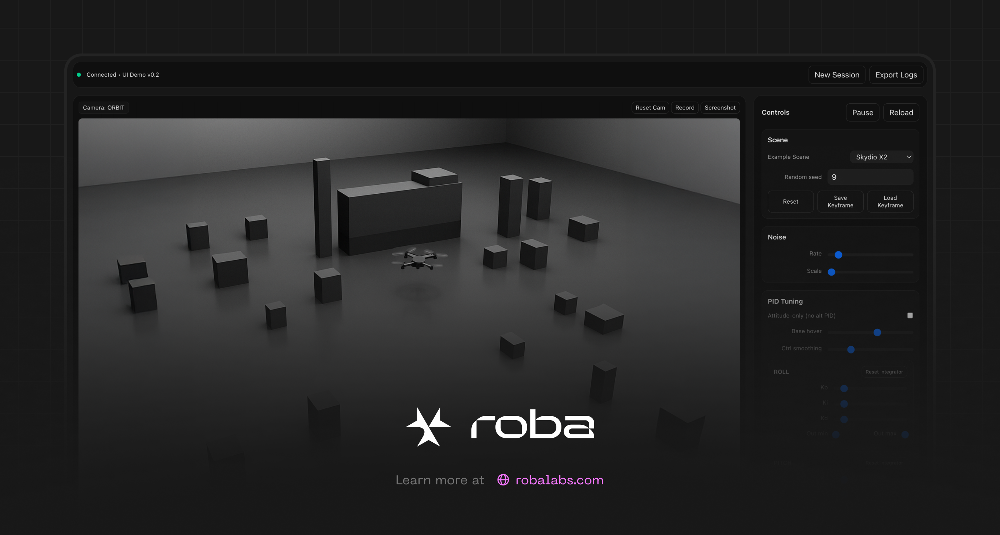
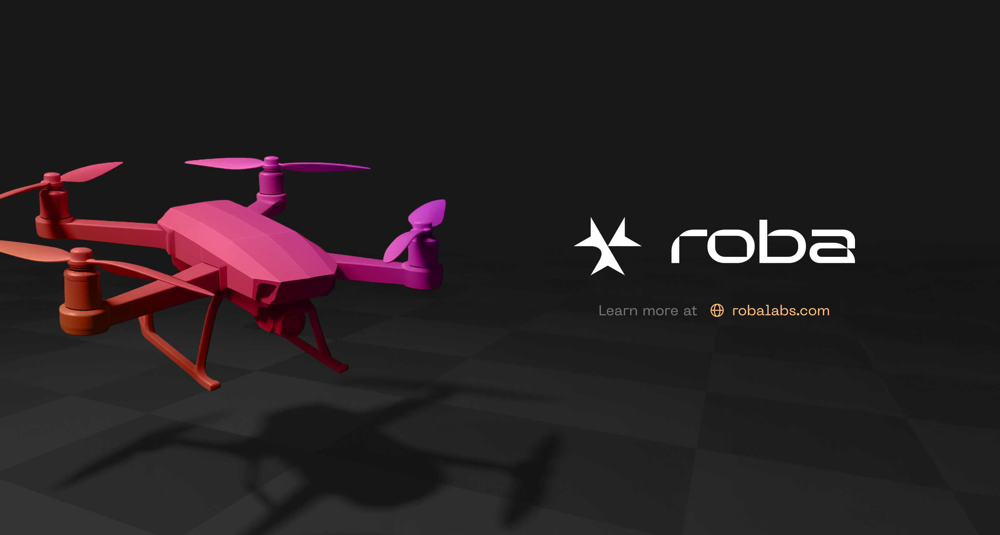

# roba-research

roba research brings together our most active robotics and simulation projects: MuJoCo WebAssembly ports, advanced browser front-ends, a humanoid research platform, a MuJoCo Warp-based RL lab, and a comprehensive object-model library.

## Projects

### sim2game


Sim2game streams MuJoCo physics straight into the browser through a WASM runtime paired with a modular Three.js front-end. Ready-to-run aerospace and legged-robot scenes, telemetry overlays, recording pipelines, ROS hooks, and a cleanly segmented codebase (runtime, browser app, generators, toolchain) make it easy to extend.

We reorganised the workspace into the Simforge layout, consolidated the asset pipeline with `index.json`, modularised controller generators, and expanded the telemetry/recording stack. Shortcuts, richer waypoint editing, video capture, logging, and automation scripts for WASM bindings round out the experience.

#### Quick Start
```bash
# Serve from the project root
python -m http.server 8000
# Browser: http://localhost:8000/simforge/apps/browser-lab/public/lab.html
```
```bash
# Serve only the browser lab
cd simforge/apps/browser-lab
npx serve public
```

### mujoco_wasm


mujoco_wasm delivers a fully client-side MuJoCo sandbox. The web app combines the WebAssembly engine with a Three.js interface, packaged scenes, and tools for recording, replay, and tuning simulations.

We expanded the sandbox into a complete browser application with a modular interaction toolkit, CMA-ES tuner, Chart.js dashboards, automated binding generators, and prebuilt deployment artefacts in `deployables/`.

#### Quick Start
```bash
npm install
npx http-server -p 8080 .
# Browser: http://localhost:8080/index.html
```

### mjlab


mjlab combines the Isaac Lab API with MuJoCo Warp to offer a lightweight RL lab for advanced robotics experiments. It focuses on GPU-accelerated training pipelines (e.g., Unitree G1 velocity tracking and motion imitation) and uv-based workflows for fast iteration.

#### Quick Start
```bash
uvx --from mjlab --with "mujoco-warp @ git+https://github.com/google-deepmind/mujoco_warp@486642c3fa262a989b482e0e506716d5793d61a9" demo
```

### mujoco_scanned_objects


mujoco_scanned_objects provides MJCF models for 1,030 household objects from Google’s Scanned Objects dataset. Each object ships with visual and collision meshes plus textures, ready to drop into MuJoCo.

#### Quick Start
Open any `model.xml` inside `mujoco_scanned_objects/models/**/` with the MuJoCo `simulate` binary (drag and drop or pass the path as an argument) to inspect the meshes. Switch between visual (group 2) and collision (group 3) layers in the viewer.

### poppy-humanoid


poppy-humanoid is an open, 3D-printed humanoid robot tailored for research and education. It offers modular mechanics, a comprehensive software toolkit, and a thriving support community.

#### Quick Start
```bash
# Install the software locally
pip install poppy-humanoid
```
Alternatively, flash the ready-made Raspberry Pi image from the releases onto an SD card and boot the board.


## Project Summary
| Name | Description | License | Original Repo |
| --- | --- | --- | --- |
| sim2game | Browser-based MuJoCo lab with WASM runtime and modular controllers | MIT | https://github.com/k1a11220/sim2game |
| mujoco_wasm | Client-side MuJoCo sandbox with a Three.js front-end | MIT  | https://github.com/zalo/mujoco_wasm |
| mjlab | MuJoCo Warp-powered RL lab built on the Isaac Lab API | Apache-2.0 | https://github.com/mujocolab/mjlab |
| mujoco_scanned_objects | 1,030 MJCF models of scanned household objects | CC-BY 4.0 + MIT | https://github.com/kevinzakka/mujoco_scanned_objects |
| poppy-humanoid | Open-source humanoid robot for research and education | CC BY-SA 4.0 + GPLv3 | https://github.com/poppy-project/poppy-humanoid |

## Update Submodules
```bash
git submodule update --init --recursive
```
